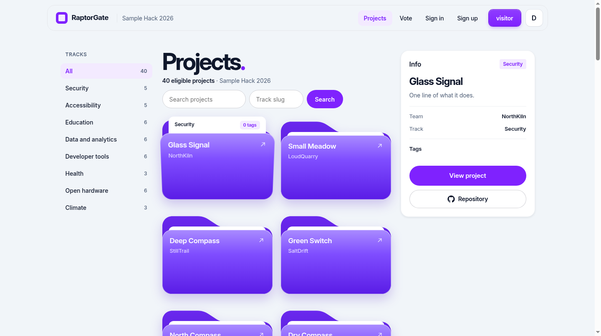
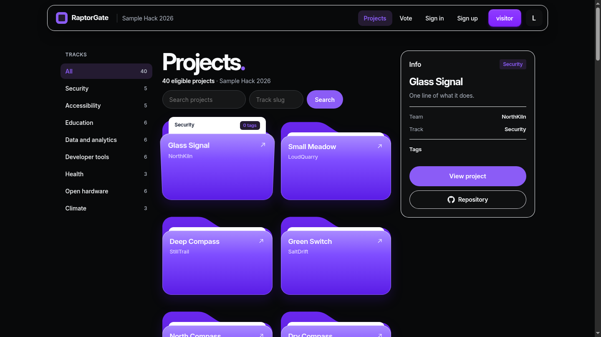
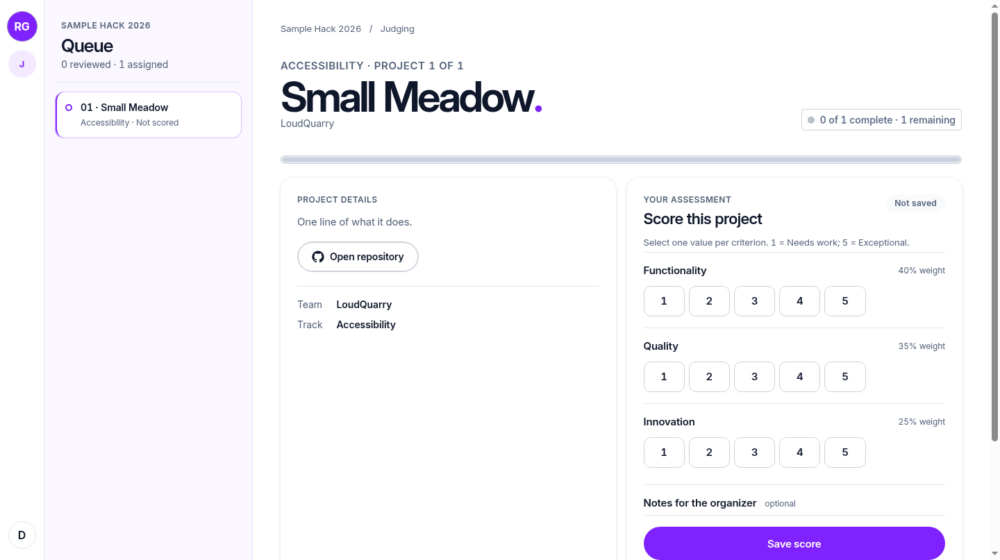
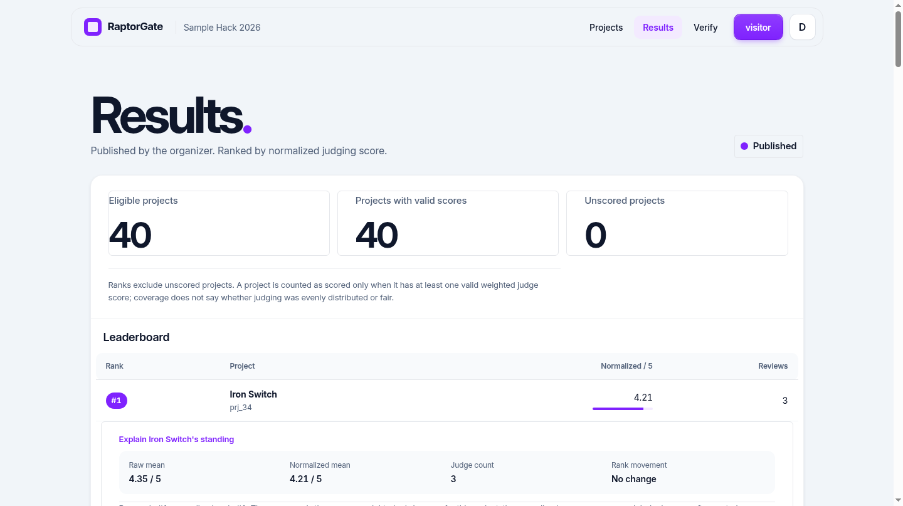
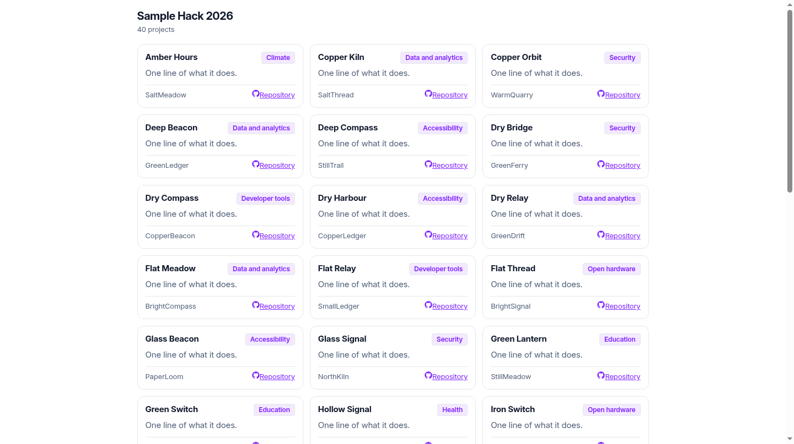

# RaptorGate | Dogfood 2026

A self-hosted hackathon portal from submission to judged results, built fresh for Dogfood 2026.

`License: MIT`

- Local PostgreSQL: 296 Django and 299 pytest tests passed on the integrated UI source; see [Testing and proof](#testing-and-proof).
- Official checker: 7/7 literal T1/T2 PASS lines on the integrated UI source. The checker exit code alone is not a verdict.
- Independent cold boot: a hash-verified amd64 image archive booted offline for exact earlier source `24d9a638`; [scope and logs](packaging/evidence/EVIDENCE-README.md). It does not cover later UI commits.

`API.md` describes the current partial JSON API. The test counts are local PostgreSQL runs on this source, not automated CI. A separate pre-login signup POST without a CSRF cookie returned HTTP 403 as designed; the browser flow obtains the token on GET. See the linked cold-boot scope for its limits.

## Features

### Event and submission workflow

- **Event setup and drafts:** organizers set an event name, deadline, optional public prize and submission questions. Team members can save a private project draft, edit it before the deadline, and publish; submitted projects cannot revert to drafts. `test_draft_flow.py`, `test_draft_visibility.py` and `test_event_prize.py` cover these paths.

### Judge workflow

- **Judging:** assignment-scoped console with server-confirmed autosave; backend role, track and team-conflict checks; editable rubric, score audit and CSV export. Organizer results show raw and normalized standings and tied ranks. A reproducible fixture proof in `NORMALIZATION-PROOF.md` and `normalization-proof.csv` shows the rank changes and the limits of the method.

### Community participation

- **Voting and results:** searchable gallery, project detail and moderated comments; authenticated one-vote-per-event ballot with stable randomized order, rate checks, receipt and organizer vote audit. Results and receipt lookup open only after voting closes and the organizer publishes.

### User interface

- **Local-first design:** light-first UI with a saved dark choice across judge, gallery, ballot, organizer and results screens. A separately styled, read-only gallery widget can be embedded on other sites.
- **Responsive and accessible:** the dual-theme sweep checked desktop, tablet and mobile widths, keyboard toggle, persisted choice and mobile overflow.

Bonus challenge mapping: **+5 Normalization Proof** - `NORMALIZATION-PROOF.md` and `normalization-proof.csv` reproduce rank movement; **+3 Threat Model** - `THREAT-MODEL.md` maps attack surfaces and mitigations. These are bonus attempts, not additional acceptance-checker PASS lines.

`.dogfood.toml` claims T1/T2, the scope verified by the official checker. The T3 voting features and T4 widget, JSON API, participation records, portable JSON certificates and one results-published webhook are working slices, not blanket tier claims. See `T3-VOTER-ACCESS.md` for the three access modes and their trust limits. See [Current routes](#current-routes), [Roadmap](#roadmap) and the design documents for details.

### Screenshots (local fixture, integrated UI)







The judge screenshot uses an isolated local fixture copy with a single assignment added for rendering. The results screenshot uses another isolated copy with the publication and voting-close gates satisfied. Neither copy changed the published preview or checker database.

## Demo-only secrets and DEBUG - read before deployment

**This repository is a localhost demo, not a production-ready deployment.** The checked-in Compose file has a fixed PostgreSQL password and `DJANGO_SECRET_KEY`; the Django fallback key is also fixed, and `DJANGO_DEBUG` defaults to **on** outside Compose (Compose sets it to `0`). The checker config includes fixed demo session credentials. Do not expose this stack to the internet, reuse the demo credentials, or deploy it as-is. For a non-demo deployment, supply unique secrets outside version control, set `DJANGO_DEBUG=0`, restrict hosts/network access, rotate demo credentials and review the deployment security settings first.

## Quickstart

From the repository root on a Docker-capable machine with network access for the first build:

```sh
docker compose build
docker compose pull db
docker compose up
```

This fetches Python/PostgreSQL images and Python packages while online, then starts PostgreSQL 16 and Django 5.2, applies migrations and seeds `fixtures.json` when the database has no event. Open http://localhost:8080/projects. Compose binds to `127.0.0.1:8080`. This is a local demo configuration with fixed credentials; do not publish it directly.

## Judge this in 10 minutes

1. Run the three Quickstart commands, then open [the local gallery](http://localhost:8080/projects). Search a fixture title and switch light/dark with the header button.
2. Open [organizer overview](http://localhost:8080/organizer/overview) after signing in as `event-organizer`. Its localhost-only password is set in `src/eventhub/management/commands/seed_event.py`; `.dogfood.toml` lists the demo role sessions for automated probes. Do not use these demo credentials on the public preview.
3. Follow **Open organizer results** for the private standings and use the overview's export links to inspect the fixture data. Do not publish downloaded CSVs: they include private rows.
4. Sign out, then sign in as `judge-jdg_01` with the same localhost-only fixture password. Open [the judge console](http://localhost:8080/judge/console). The fresh fixture has scores but no live assignments, so the empty queue is expected; it does not claim a live scoring demo.
5. Run `python3 run.py .dogfood.toml` from another terminal. Read the seven literal PASS lines for the claimed T1/T2 probes; the process can exit zero despite a FAIL line.
6. To see published standings with real fixture scores, open [the read-only hosted results preview](https://raptorgate-dogfood-preview.onrender.com/results). It is a separate, sanitized preview database and may take time to wake.

A full live score-to-publish run needs judge assignments plus an event voting window. A separate local event-lifecycle recording was made before this UI handoff; the fresh Compose fixture does not set the full flow up automatically.
Known limits: published results are recomputed from current scores rather than frozen at publication, so a later authorized score edit can change the public rankings. A newly created event has no tracks and the organizer UI does not create them; tracks need admin or seed setup before submissions can complete.

For an offline demonstration, `packaging/README.md` gives the online image-build/archive-export and offline load/boot steps, including Windows PowerShell scripts. Docker Desktop and a prebuilt archive must be available on the target Windows PC. An operator outside the build team produced the independent Ubuntu x86_64 cold-boot logs for the earlier source linked above. The logs show an offline DNS failure; the operator separately reported the network interface was down. See `packaging/README.md` for exact scope and limits. This was not a Windows or arm64 run, nor a cold boot of the later UI source.

The seeded sample event closes submissions at `2026-03-01T18:00:00Z`; create a separate open event for a live submission demonstration and select it with the organizer-only `POST /events/select` route. The imported fixture has 41 project rows (40 canonical after dedupe); one duplicate remains in storage but is hidden from the public gallery.

Organizer-only lifecycle CSV snapshots for the active event are at `/organizer/export/{teams,submissions,assignments,scores,results}.csv` and linked from the organizer overview. Teams include individual member email addresses; submissions include drafts and duplicates; scores include raw criteria and comments; results include raw and normalized ranks even before publication. Keep downloaded CSVs private. These read-only exports do not import participant, assignment or score state and are limited to 5,000 rows per file. The legacy `/api/export.csv` route remains unchanged for the checker.

Run the official checker:

```sh
python3 run.py .dogfood.toml > acceptance-report.txt
cat acceptance-report.txt
```

The committed report records three T1 and four T2 PASS lines, `claimed T1 T2, verified T1 T2`, from this source on a fresh migrated and fixture-seeded local PostgreSQL database with the checker pointed at an isolated localhost port 18909. It is a separate local check, not the independent Docker or offline cold-boot log. The checked-in `.dogfood.toml` defaults to localhost:8080 for Compose. Rerun the checker on the final submission tree and read each result line; it can exit zero even when a line says FAIL. `.dogfood.toml` supplies local demo sessions and routes, not production credentials.

Install `requirements-dev.txt` into a Python environment, then run `PYTHONPATH=src python src/manage.py test eventhub.tests` and `PYTHONPATH=src pytest -q`. Run both against the final submission tree.

## Architecture

- Django 5.2 serves HTML pages and role-checked endpoints; PostgreSQL 16 stores event, team, project, judge, assignment, score and participation records.
- Event and track checks run on the server. Score writes are transaction-locked and audited; organizer results normalize each judge's scoring spread while keeping raw scores visible.
- The public ballot derives a stable per-voter project order, writes one vote per account and event, and holds receipts/results behind the release gate. The embeddable gallery is read-only and uses its own CSS and content-security policy.
- `src/eventhub/` owns models, views and tests; `src/templates/` and `src/static/` own the UI; `packaging/` contains the image-bundle handoff. See `ARCHITECTURE.md`, `DATA-MODEL.md`, `JUDGING.md` and `THREAT-MODEL.md` for the design and its risk decisions.

## Testing and proof

On the integrated UI source, both full runners passed on real PostgreSQL: **296/296 Django tests** and **299/299 pytest tests** (including three packaging checks), no skips. Pytest reported four Django 6 URL-field default-scheme deprecation warnings, not failing tests. SQLite can skip PostgreSQL-only concurrency cases, so its total is not comparable. On a fresh migrated and fixture-seeded PostgreSQL database, the official checker returned **7/7 literal PASS lines** for the claimed T1/T2 probes. The checked-in `acceptance-report.txt` captures the seven PASS lines on isolated port 18909; the checker was rerun after the full Django and pytest suites with the same seven PASS lines. These local checks are separate from the earlier-source independent Docker cold-boot logs linked above. The separate local event-lifecycle video is not an offline cold-boot proof either.

Selected regression cases that can be inspected in `src/eventhub/tests/`:

| Case | Expected result and boundary |
| --- | --- |
| Signup with a forged `is_staff` or `is_superuser` POST field | Extra privilege fields are ignored by the user-creation form; signup makes a normal user, not an organizer or judge. `test_signup.py` now directly checks this injected-field case; the reviewer also probed it live. |
| Duplicate username, short/common/mismatched password, and authenticated signup | Invalid or redundant registration is rejected; successful registration can log in, with no judge role. `test_signup.py`. |
| Judge comment-only revision | `ScoreAudit.previous` retains the old comment and criteria; `current` holds the new comment and criteria. Non-organizers cannot fetch the audit trail. `test_judging.py`. |
| Edited certificate JSON | Changing the signed payload makes the Ed25519 check fail (red on `/verify`, nonzero exit offline). `test_verify_public.py`. |
| Validly self-signed but unissued certificate | Signature alone is not trusted by the site: `/verify` rejects it as not a published issuance. `test_verify_public.py`. |
| Offline certificate with a different trusted public key | `verify.py` exits nonzero despite the intact signature. Without a supplied trusted key, it reports internal signature validity but explicitly does **not** verify issuer identity. `test_verify_public.py`. |
| Vote receipt and participation record | Receipt checks are gated until publication and reveal no voter identity, but the receipt is a bearer capability: any holder can use `/receipt/<secret>/proof` to learn the voted project after release; HMAC record checks need the server-held key and cannot be independently verified. `test_verify_public.py`. |
| Organizer vote signals | The panel is superuser-only, event-scoped and aggregate-only; shared IPs and retry counts are labeled signals, not verdicts. `test_vote_signals.py`. |
| Results expander | Raw and normalized means, judge count, rank movement and unscored state are aggregate-only. The public page does not expose judge identities, comments or individual ballots; it stays gated before publication. `test_results_explainer.py`. |

Other suites exercise event and track isolation, team and judge permissions, concurrent first submissions/scores, rubric/ranking ties, ballot identity modes and duplicate/rate controls, results release gates, widget isolation, CSV import, certificates, records, the partial API and publication webhook. Test counts describe executed cases, not proof of full T3/T4 tier completion.

### UI accessibility sweep (September 29, 2026)

A prior live Chrome/axe-core 4.13.0 sweep of eight light-theme and matching dark-theme routes found **zero automated WCAG 2 A/AA and WCAG 2.1 A/AA violations** after contrast and focus fixes. This is a snapshot, not a WCAG compliance certificate. `test_accessibility.py` guards landmarks, labels and native expanders; screen-reader and full manual zoom/contrast checks remain open. The integrated UI needs its own accessibility audit.

### Highlights

- Public participant self-signup at `/signup/`, with normal-account permissions; judge invitations and assignments remain separate.
- Judge `Score.comment` edits captured in both sides of `ScoreAudit` snapshots.
- Public `/verify` and standalone `verify.py` with distinct claims for certificates, receipts and HMAC records; the offline command checks Ed25519 and can compare a trusted organizer key.
- Published standings row expander for aggregate raw-versus-normalized math and rank movement, without individual judge details.
- Public scoring coverage counts on results: eligible canonical non-draft projects, projects with at least one valid weighted score, and unscored projects. Ranks exclude unscored projects; these counts do not prove equal judging coverage or fairness.
- Public results methodology panel shows the event rubric weights, per-judge centering and clamping formula, zero-spread fallback and tie policy, with sparse-judging and statistical-fairness caveats. It reveals no individual judge values or identities.
- Organizer-only vote activity panel at `/organizer/vote-signals` showing signals, not verdicts: retained attempt frequency, shared-IP actor counts, and accepted vote/cast-audit count differences. No IPs, actor keys, voter identities or receipts are shown on that panel.

An independent amd64 offline Docker cold boot is documented in `packaging/evidence/`. Do not treat the reviewer’s probes or the official checker as a security audit.

## Offline proof

What was proven: the app cold-boots from the built image archive on amd64 after the operator reports disconnecting the VM network. The archived logs show a DNS failure, not NIC state. Exact commit tested: `24d9a638f3f244ab98b7881e47aa8b91886e2ba0`.

How: an operator outside the build team used a fresh disposable Multipass Ubuntu VM. The image was built and checksummed while online (`sha256sum -c` says OK). The operator reports disabling the network interface before boot and proof; the archived logs do not independently show that NIC state. The stack was loaded from the archive and booted with `--no-build --pull never`.

Result: PostgreSQL becomes healthy. Migrations apply. The seed writes 41 project rows (40 canonical after dedupe). The portal serves on `127.0.0.1:8080`. The gallery and its theme CSS return HTTP 200. The official checker prints exactly 7 PASS lines, 0 FAIL, and ends with `claimed T1 T2, verified T1 T2`.

Evidence: sanitized logs live in `packaging/evidence/`. The sanitized archive `rg-evidence-final.tgz` holds `offline-proof.log`, `done-criteria.log`, `seed-counts.log`, `compose-ps.log`, `network-off.log` and more. The folder also holds `retry-team-form.log` and `EVIDENCE-README.md`. Host paths were sanitized. The VM has since been purged; the operator reports retaining a verified host-side `rg-originals-backup.tgz` until results, containing 15 final-tree logs, the v2 and final evidence archives, retry-team-form.log, rg-sweep.py, MANIFEST and MISSING.txt. The v3 logs survive only sanitized (`/home/<user>` to `/home/USER`); proof3.out and temporary HTML/cj.txt artifacts were lost, documented in MISSING.txt. See `packaging/README.md` for the full scope notes.

Limitations:

- The proof covers amd64 only. The arm64 cross-build needs QEMU/binfmt.
- The UI sweep was HTTP-level, not visual. It did not render pixels.
- The first team-form attempt returned 403, and a retry after GET returned 302. The saved server lines in `retry-team-form.log` show only HTTP codes and order, not the CSRF cause or redirect target. The stale-token explanation is the operator’s account, not something the log proves. This diagnostic is outside the seven official PASS lines.

Reproduce: run `packaging/run-offline.sh` against a checksum-verified archive. The Linux steps are in `packaging/README.md`.

## Current routes

| Area | Routes | Access and limits |
| --- | --- | --- |
| Public discovery | `GET /projects`, `GET /projects/<slug>`, `GET /embed/<event-slug>/gallery` | Canonical, non-draft projects only; `q` and `track` filter gallery. The widget is read-only with its own CSS/CSP. |
| Accounts and teams | `GET/POST /signup/`, `/login/`, `/teams/new`, `/teams/<slug>/invite`, `/join/<token>` | Signup gives a normal account, not judge/organizer authority. Team membership is event-scoped. |
| Submissions and event setup | `/projects/new`, `/events/new`, `POST /events/select`, `/organizer/questions` | Team submissions before close; event selection is organizer-only and global. New events have no tracks until provisioned. |
| Judge and assignment | `/judge/console`, `/judge/assignments`, `/judge/score/<slug>`, `/organizer/judges/invite`, `/judge/accept/<token>`, `/organizer/assign`, `/organizer/assign/batch`, `/api/judge/scores` | Judge scores are assignment-scoped; organizers manage invites and assignment. |
| Organizer results and exports | `/organizer/overview`, `/organizer/results?view=html`, `/organizer/rubric`, `/organizer/audit`, `/organizer/publish`, `/api/export.csv`, `/organizer/export/{teams,submissions,assignments,scores,results}.csv` | Organizer-only. Lifecycle CSV may include member emails, drafts and raw scores even before publication; keep files private. |
| Project bulk import/export | `GET /organizer/projects.csv`, `POST /organizer/projects/import` | Organizer-only. Export up to 5,000 projects. Import creates 1-500 projects from a UTF-8 CSV up to 1 MB, when submissions are open and results unpublished; teams/tracks must exist. Legacy six-column or enriched export header accepted; this does not migrate users or scores. |
| Voting and moderation | `GET /ballot`, `POST /vote`, `POST /projects/<slug>`, `/organizer/vote-audit`, `/organizer/vote-signals`, `POST /organizer/comments/<id>/hide` | Active event and identity gates. Vote signals are private aggregates, not fraud verdicts. |
| Public results and proof | `GET /results`, `/receipt/<secret>`, `/receipt/<secret>/proof`, `GET/POST /verify`, `/certificates/<id>.json` | Results and receipts release after voting closes **and** organizer publication; receipt is a bearer capability. Verification claims differ by artifact. |
| Extended interfaces | `/api/v1/*`, `/organizer/records/issue`, `/records/<id>/verify`, `/organizer/certificates/issue`, `/organizer/webhooks/deliveries` | Partial JSON API, HMAC record snapshot, separate signed certificate and one results-published webhook. See `API.md`, `PARTICIPATION-RECORDS.md`, `CERTIFICATES.md`, `WEBHOOKS.md`. |

The active event selector changes the gallery and judging scope for everyone. Some routes fall back to the oldest event when none is active; check the selected event before a demo. Open-link voting uses organizer-issued one-use links; email voting uses a one-time SMTP code and fails closed without SMTP. The widget defaults to light, accepts `?theme=dark`, and does not carry the main app's saved theme. For an iframe:

```html
<iframe src="http://localhost:8080/embed/evt_01/gallery" sandbox="allow-same-origin"
        referrerpolicy="no-referrer" title="Event projects"
        style="width:100%;min-height:480px;border:0"></iframe>
```

The widget allows embedding by any origin by default (`frame-ancestors *`); `WIDGET_FRAME_ANCESTORS` in settings narrows hosts, but there is no environment-variable hookup yet. Do not embed voting sessions or private results. `python verify.py certificate.json --trusted-public-key <trusted-base64url-key>` checks a certificate signature offline with `cryptography`; without a separately trusted key, issuer identity remains unverified. This is not complete REST or full webhook coverage.

## Roadmap

Loopback SMTP delivery is covered by `test_smtp_delivery.py` using a local `aiosmtpd` server. This is not proof of an external provider or production mail delivery. The partial API and one published-results webhook need wider coverage; see `API.md` and `WEBHOOKS.md`. HMAC records are not certificates; portable Ed25519 JSON certificates have separate key-pinning limits. Arm64 and Windows offline boots remain unproved. Keep `.dogfood.toml` at T1/T2 until later tiers are finished and independently checked.

Publication needs a separate review of repository contents and demo credentials. Freeze: Tuesday 29 September 2026, 18:00 UTC (23:30 IST), per https://dogfoodhack.com/ and https://dogfoodhack.com/spec/ checked 28 September 2026.

## Optional hosted UI preview

`preview.Dockerfile` and `preview-start.sh` provide an optional public preview alongside the unchanged local `docker compose up` path. It requires unique runtime `DJANGO_SECRET_KEY`, `RAPTORGATE_PUBLIC_PREVIEW=1`, `DJANGO_DEBUG=0`, `RAPTORGATE_PREVIEW_HOST=<exact service>.onrender.com`, and `DATABASE_URL` for a separate PostgreSQL database. The preview starts from a sanitized copy of the official fictional fixture: 41 project rows (40 canonical) and 126 score rows, with published results. It stores 30 unusable-password placeholder judge accounts solely to preserve score relations, no participant/admin logins, no sessions, no judge emails or score comments, and no fixture tokens. The preview shows the gallery, standings, coverage and ranking method, plus a GET-only UI tour at `/tour/judge`, `/tour/ballot`, `/tour/organizer`, `/tour/standings`, `/tour/voter`, `/tour/login`, `/tour/signup`, `/tour/event`, `/tour/questions`, `/tour/submit`, `/tour/team`, `/tour/invite`, and `/tour/signals`. These tour pages render sanitized sample context and are not live voting, scoring, account access, or organizer operation. Every write request returns 405; operational vote/login/organizer URLs still redirect to the gallery. Do not run the fixture `seed_event` command or use `.dogfood.toml` demo cookies against the public preview. Free Render sleeps when idle and its free PostgreSQL expires in 30 days, without backups. The hosted preview does not replace the offline, seeded, one-command submission requirement.
